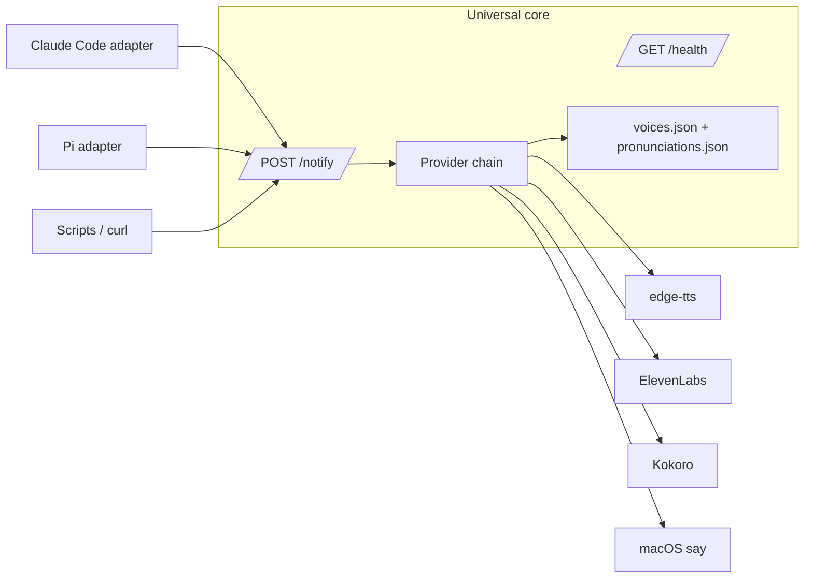

# Echo

Standalone, multi-provider TTS notification server for coding agents, terminals, and scripts.

The server core accepts JSON on `localhost:8888` and speaks through a provider chain (`edge-tts → ElevenLabs → Kokoro → macOS say`). Host-specific lifecycle behavior now lives in adapters:

- `adapters/claudecode/` — Claude Code hook integration.
- `adapters/pi/` — Pi extension package integration.
- direct HTTP — any process can POST to `/notify`.

## Architecture



The universal core is in `core/`. It should not import host adapters or assume PAI, Pi, or any other harness.

## Quickstart

Requires macOS and [Bun](https://bun.sh/). New to Echo? Follow the guided tutorial
instead: **[docs/getting-started.md](docs/getting-started.md)**.

```bash
bash scripts/install.sh --adapter none
```

The installer output ends with:

```
OK echo is healthy on :8888
```

Send your first spoken notification:

```bash
curl -X POST http://localhost:8888/notify \
  -H 'Content-Type: application/json' \
  -d '{"message":"Hello from Echo"}'
```

You should hear "Hello from Echo" spoken aloud and see:

```json
{"status":"success","message":"Notification sent","request_id":"..."}
```

Hear nothing, or an unexpected voice? See [If you hear nothing — or the wrong voice](docs/getting-started.md#if-you-hear-nothing--or-the-wrong-voice).

## Install

The quickstart above installs the core only. To also wire a host adapter:

```bash
bash scripts/install.sh --adapter claudecode   # Claude Code hooks
bash scripts/install.sh --adapter pi           # Pi extension
bash scripts/install.sh --adapter omp          # oh-my-pi extension
```

Full install guide for humans (adapters, moved repos, uninstall): [docs/install-human.md](docs/install-human.md).

Step-by-step checklist for autonomous agents: [docs/install-agent.md](docs/install-agent.md).

## Operation

```bash
bash scripts/status.sh
bash scripts/restart.sh
bash scripts/stop.sh
bash scripts/start.sh
```

Manual health check:

```bash
curl -fsS http://localhost:8888/health
```

Silent smoke request:

```bash
curl -fsS -X POST http://localhost:8888/notify \
  -H 'Content-Type: application/json' \
  -d '{"message":"smoke","voice_enabled":false}'
```

Update-after-pull, repo moves, logs, and uninstall caveats: [docs/operations.md](docs/operations.md).

## API

Three endpoints. Full contract: [docs/http-api.md](docs/http-api.md).

### `POST /notify`

```json
{
  "message": "Task complete",
  "voice_id": "themis",
  "title": "Voice Notification",
  "voice_enabled": true
}
```

All fields are optional — a missing `message` defaults to `"Task completed"`.
`voice_enabled: false` keeps the notification path silent for smoke tests.

`voice_id` takes a persona **name key** from `voices.json` (e.g. `kai`, `themis`). Omit it
to get the default Atlas identity voice; an unrecognized value falls back to the active
provider's default. See **Voices** below for resolution order.

### `POST /notify/personality`

Compatibility endpoint for callers that only provide a `message`.

### `GET /health`

Returns provider status, fallback order, circuit-breaker state, pronunciation rule count,
and emotional preset count. Each provider entry includes an egress audit; note that the
default provider, `edge-tts`, is an **online** Microsoft service. Details:
[docs/http-api.md](docs/http-api.md) and
[docs/providers-observability.md](docs/providers-observability.md).

### Voice-resolution drop-off log

To make it observable *why* a `/notify` used the voice it did, the daemon appends one
structured JSONL event per voice-enabled `/notify` to
`~/Library/Logs/echo/voice-resolution.jsonl` — separate from the human-readable daemon log
(`~/Library/Logs/echo.log`). Fields, retention, and overrides:
[docs/providers-observability.md](docs/providers-observability.md).

## Voices

Voices are configured per agent in `core/voices.json`. The `identity` mapping is the
default ("Atlas") voice — it speaks whenever `voice_id` is omitted. Every entry under
`agents` is a named persona keyed by a short lowercase name (`engineer`, `architect`,
`themis`, `clauderesearcher`, …). Select one by sending `"voice_id": "<key>"`.

**Resolution order** (`getVoiceMapping` in `core/server.ts`): the `voice_id` is matched against (1) an `agents` **name key**, then (2) any agent's `elevenlabs.voice_id`, then (3) the `identity` voice; no match falls back to the active provider's default voice. So callers should send the **name key** (e.g. `"themis"`), not a raw provider voice id.

For the default `edge-tts` provider, each agent maps to a Microsoft neural voice with an optional `speed` (a multiplier converted to edge-tts's `--rate`, e.g. `1.08 → +8%`, `0.94 → -6%`). A `speed` of `1.0` (or no `edgetts` block) uses the global `providers.edgetts.rate`.

```json
"engineer": {
  "edgetts": { "voice": "en-GB-ThomasNeural", "speed": 0.94 }
}
```

Changing a persona's voice, adding a new persona, and the per-turn persona voice spoken
by the Claude Code Stop hook are covered in [docs/voices.md](docs/voices.md).

### Gotchas that cause silence

- Sending a raw ElevenLabs voice id instead of the `voices.json` name key won't resolve
  while ElevenLabs is disabled.
- Port `31337` is wrong — voice traffic is `:8888`.

### Auditioning edge voices

Choose voices by ear with `bun scripts/preview-voices.ts` before editing `core/voices.json`. Commands and the full flag table live in [docs/voices.md](docs/voices.md).

## Deprecated environment variables

Echo reads its configuration from `ECHO_*` environment variables. The project's
former names — `ATLAS_VOICE_*` (Pi adapter) and `VOICESYSTEM_*` (core) — **still
work as silent fallbacks**, so nothing breaks on upgrade, but they are
**deprecated** and slated for removal in a future major release.

**Read order:** the canonical `ECHO_*` name is read first; if it is unset, the
legacy name(s) are consulted in order. Two settings converge two old names onto a
single canonical name (priority `ECHO_*` → `ATLAS_VOICE_*` → `VOICESYSTEM_*`).

| Old name | New canonical | Notes |
|---|---|---|
| `ATLAS_VOICE_NOTIFY_URL` | `ECHO_NOTIFY_URL` | **convergence** (with `VOICESYSTEM_NOTIFY_URL`) |
| `VOICESYSTEM_NOTIFY_URL` | `ECHO_NOTIFY_URL` | **convergence** (lowest priority) |
| `ATLAS_VOICE_ID` | `ECHO_VOICE_ID` | **convergence** (with `VOICESYSTEM_VOICE_ID`) |
| `VOICESYSTEM_VOICE_ID` | `ECHO_VOICE_ID` | **convergence** (lowest priority) |
| `ATLAS_VOICE_TITLE` | `ECHO_VOICE_TITLE` | |
| `ATLAS_VOICE_CATCHPHRASE` | `ECHO_VOICE_CATCHPHRASE` | |
| `ATLAS_VOICE_PERSONA_NAME` | `ECHO_VOICE_PERSONA_NAME` | default value is now `Pi` (#76) |
| `ATLAS_VOICE_ENABLED` | `ECHO_VOICE_ENABLED` | |
| `ATLAS_VOICE_GREET_ON_START` | `ECHO_VOICE_GREET_ON_START` | |
| `ATLAS_VOICE_SPEAK_COMPLETIONS` | `ECHO_VOICE_SPEAK_COMPLETIONS` | |
| `ATLAS_VOICE_SUPPRESS_SUBAGENTS` | `ECHO_VOICE_SUPPRESS_SUBAGENTS` | |
| `ATLAS_VOICE_SUPPRESS` | `ECHO_VOICE_SUPPRESS` | |
| `VOICESYSTEM_ENV_PATHS` | `ECHO_ENV_PATHS` | |
| `VOICESYSTEM_DEFAULT_TITLE` | `ECHO_DEFAULT_TITLE` | |
| `VOICESYSTEM_AUDIO_PROCESS_TIMEOUT_MS` | `ECHO_AUDIO_PROCESS_TIMEOUT_MS` | |
| `VOICESYSTEM_NOTIFICATION_PROCESS_TIMEOUT_MS` | `ECHO_NOTIFICATION_PROCESS_TIMEOUT_MS` | |
| `VOICESYSTEM_AUDIO_CACHE_DIR` | `ECHO_AUDIO_CACHE_DIR` | |
| `VOICESYSTEM_EDGETTS_TIMEOUT_MS` | `ECHO_EDGETTS_TIMEOUT_MS` | |
| `VOICESYSTEM_EDGETTS_SYNTH_RETRIES` | `ECHO_EDGETTS_SYNTH_RETRIES` | |
| `VOICESYSTEM_EDGETTS_SYNTH_BACKOFF_MS` | `ECHO_EDGETTS_SYNTH_BACKOFF_MS` | |
| `VOICESYSTEM_RESOLUTION_LOG` | `ECHO_RESOLUTION_LOG` | |
| `VOICESYSTEM_RESOLUTION_LOG_MAX_BYTES` | `ECHO_RESOLUTION_LOG_MAX_BYTES` | |
| `VOICESYSTEM_CIRCUIT_BREAKER_THRESHOLD` | `ECHO_CIRCUIT_BREAKER_THRESHOLD` | |

### Migrating

**Human:** search your shell profile, `~/.config/echo/.env`, and your LaunchAgent
plist for the old names and replace each per the table above, then restart the
daemon:

```bash
rg -l 'ATLAS_VOICE_|VOICESYSTEM_' ~/.zshrc ~/.bashrc ~/.config/echo/.env 2>/dev/null
bash scripts/restart.sh
```

**Agent:** run `rg -l 'ATLAS_VOICE_|VOICESYSTEM_'` across your config locations,
rewrite each match to its `ECHO_*` canonical per the table (collapsing the two
convergence pairs onto `ECHO_NOTIFY_URL` / `ECHO_VOICE_ID`), then restart the
daemon with `bash scripts/restart.sh`.

> Filesystem default paths also moved (`…/atlas-voicesystem/…` → `…/echo/…`) and
> the LaunchAgent label changed (`com.atlas.voicesystem` → `com.echo`). A
> reinstall (`bash scripts/install.sh`) migrates the running service
> automatically — see the [CHANGELOG](CHANGELOG.md).

## Documentation

| I want to… | Read |
|---|---|
| Hear my first notification (guided tutorial) | [docs/getting-started.md](docs/getting-started.md) |
| Install adapters, move the repo, uninstall | [docs/install-human.md](docs/install-human.md) |
| Start/stop/restart, update after a pull, read logs | [docs/operations.md](docs/operations.md) |
| Look up env files, `PORT`, and `voices.json` schema | [docs/configuration.md](docs/configuration.md) |
| Install via an agent-runnable checklist | [docs/install-agent.md](docs/install-agent.md) |
| Look up the HTTP API | [docs/http-api.md](docs/http-api.md) |
| Change or add voices; per-turn persona voice | [docs/voices.md](docs/voices.md) |
| Understand provider egress + the resolution log | [docs/providers-observability.md](docs/providers-observability.md) |
| Tune reliability / the circuit breaker | [docs/reliability.md](docs/reliability.md) |
| See required and optional dependencies | [docs/dependencies.md](docs/dependencies.md) |
| Write or wire a host adapter | [docs/adapters.md](docs/adapters.md) |

## Development

See `docs/development.md`.

```bash
bun test
PORT=8889 tests/smoke-core.sh
```

## Contributing

See `CONTRIBUTING.md`, especially the "Adding a Host Adapter" section.
