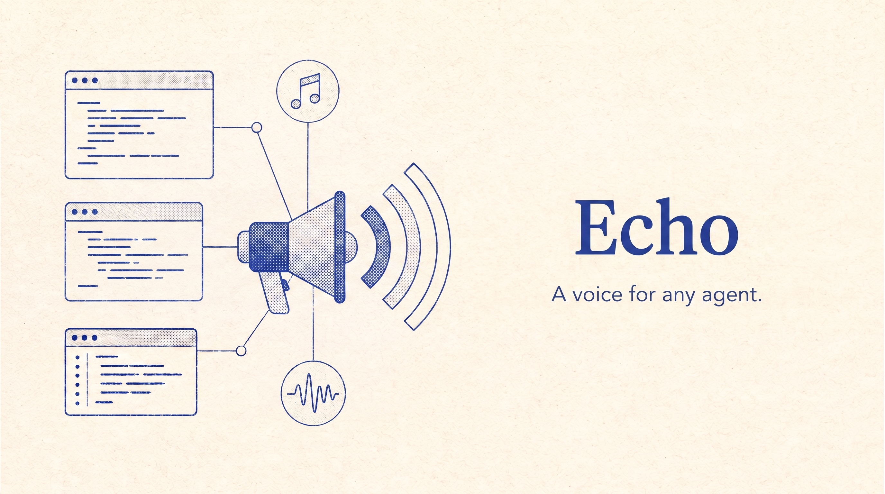
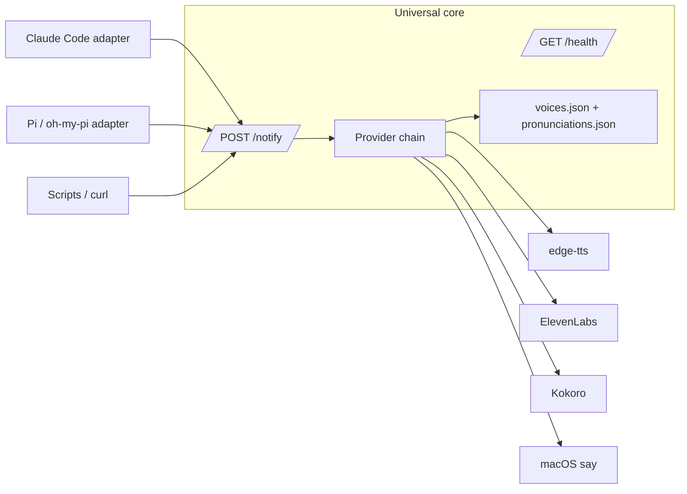

# Hear your agents.

Coding agents finish in silence. You find out they are waiting only when you look back at the terminal.

Echo speaks the completion line when the turn ends. When Claude Code, Pi, or oh-my-pi cannot continue without you, it also speaks that wait. One local daemon on your Mac. Any host that can POST JSON. [When an agent needs you](docs/what-echo-does.md#when-an-agent-needs-you).

open source · local daemon · macOS · Bun

Echo binds `localhost:3246`. The default voice provider is Microsoft edge-tts, an online service. Kokoro and macOS `say` stay on the machine. Read [What Echo does](docs/what-echo-does.md) for when it speaks and when it stays quiet.

## Without Echo / with Echo

Ambient completion audio, not a conversation loop.

| Without Echo | With Echo |
| --- | --- |
| The turn ends and the room stays quiet. | The completion line is spoken when the agent is done. |
| You notice the wait only when you look at the terminal. | You hear that completion line from across the desk. |
| The agent is blocked on a permission UI inside the turn. | Claude Code, Pi, and oh-my-pi speak that wait once. Other hosts stay quiet until the turn ends. |
| Each host, if it notifies at all, does it a different way. | One daemon on `:3246` for Claude Code, Pi, oh-my-pi, Codex, and a `curl`. |

Prefer typing? Leave the adapter off. Already installed, and someone just sat down nearby? Mute it:

```bash
cli/echo mute on
```

That silences Echo audio on the whole machine, not one session. Notifications still arrive and are logged. The daemon stays up. It does not stop Oh My Pi live chat, which speaks on its own path. See [Silence and mute](docs/what-echo-does.md#silence-and-mute) for layers, timed mute, and what still makes sound. To unload LaunchAgent `com.echo`, see [Mute vs daemon disable](docs/operations.md#mute-vs-daemon-disable).

## Hosts

Claude Code, Pi, oh-my-pi, Jcode, Grok Build, Codex, and a raw HTTP caller can speak through Echo. OpenCode gets mute. Wiring a host is optional. The three steps below use `curl` only.

First-class speech-to-text is [roadmap](https://github.com/edheltzel/Echo/issues/179), not this README. Echo can already ask one question and transcribe one reply. That is an opt-in extra, not the reason to install.

## Three steps

Requires macOS and [Bun](https://bun.sh/). The guided tutorial, including "I heard nothing," is [Hear your first spoken notification](docs/getting-started.md).

**1. Install the core**

```bash
git clone https://github.com/edheltzel/Echo.git
cd Echo
cli/echo install --adapter none
```

The output ends with `OK echo is healthy on :3246`.

**2. Turn the volume up**

**3. Hear "Hello from Echo"**

```bash
curl -X POST http://localhost:3246/notify \
  -H 'Content-Type: application/json' \
  -d '{"message":"Hello from Echo"}'
```

You should hear "Hello from Echo" and see JSON with `"status":"accepted"`. A line went in. Speech came out. `202` means the daemon took the line, not that playback has finished.

## Commands after that

```bash
cli/echo doctor          # one row per check, ends in Result: READY
cli/echo mute on         # also: off | toggle | status | 30m | on tts | on mic
cli/echo replay          # last spoken line; `replay 3` for last three
curl -fsS http://localhost:3246/health
```

`doctor` is the "did my install work" check. Mute is the shared-office switch (`tts` speaker, `mic` capture, `all` both). Replay re-speaks lines that actually played. The same `curl` you just ran is the notify path every adapter uses.

## Architecture


```mermaid
flowchart LR
  ClaudeCode[Claude Code adapter] --> Notify[/POST /notify/]
  Pi[Pi / oh-my-pi adapter] --> Notify
  Curl[Scripts / curl] --> Notify

  subgraph Core[Universal core]
    Notify --> Providers[Provider chain]
    Health[/GET /health/]
    Config[voices.json + pronunciations.json]
    Providers --> Config
  end

  Providers --> Edge[edge-tts]
  Providers --> Eleven[ElevenLabs]
  Providers --> Kokoro[Kokoro]
  Providers --> Say[macOS say]
```

The universal core is in `core/`. Host lifecycle lives in an adapter that calls `POST /notify`. The core does not import Claude Code, Pi, or any other host.

## Next

New to Echo? Stay in [Hear your first spoken notification](docs/getting-started.md). Want a coding agent to do the setup? Point it at [docs/install-agent.md](docs/install-agent.md).

Wire a host (after you have heard the smoke):

```bash
cli/echo install --adapter claudecode   # Claude Code hooks
cli/echo install --adapter pi           # Pi extension
cli/echo install --adapter omp          # oh-my-pi
cli/echo install --adapter jcode
cli/echo install --adapter grok
cli/echo install --adapter codex
cli/echo install --adapter opencode    # mute only
cli/echo install --adapter mcp        # optional one-shot voice ask for Claude Code
```

Mute is machine-wide. `/echo-mute` on hosts that register it is the same `cli/echo mute` command. See [Silence and mute](docs/what-echo-does.md#silence-and-mute) and [operations](docs/operations.md#mute). Mute vs taking the service down: [Mute vs daemon disable](docs/operations.md#mute-vs-daemon-disable).

| I want to… | Read |
| --- | --- |
| Hear my first notification (tutorial) | [docs/getting-started.md](docs/getting-started.md) |
| Understand what Echo does, when it speaks, and when it stays quiet | [docs/what-echo-does.md](docs/what-echo-does.md) |
| Know when the agent is waiting on me | [docs/what-echo-does.md#when-an-agent-needs-you](docs/what-echo-does.md#when-an-agent-needs-you) |
| Install adapters, move the repo, uninstall | [docs/install-human.md](docs/install-human.md) |
| Start, stop, restart, mute vs daemon disable, update after a pull, read logs | [docs/operations.md](docs/operations.md#mute-vs-daemon-disable) |
| Configure Echo, migrate dotenv settings, and inspect the schema | [docs/configuration.md](docs/configuration.md) |
| Install via an agent-runnable checklist | [docs/install-agent.md](docs/install-agent.md) |
| Look up the HTTP API | [docs/http-api.md](docs/http-api.md) |
| Change or add voices | [docs/voices.md](docs/voices.md) |
| Understand provider egress and the resolution log | [docs/providers-observability.md](docs/providers-observability.md) |
| Tune reliability and the circuit breaker | [docs/reliability.md](docs/reliability.md) |
| See required and optional dependencies | [docs/dependencies.md](docs/dependencies.md) |
| Write or wire a host adapter | [docs/adapters.md](docs/adapters.md) |
| Ask one question out loud and read the spoken reply | [docs/converse.md](docs/converse.md) |
| Develop against a second instance | [docs/development.md](docs/development.md) |
| Contribute | [CONTRIBUTING.md](CONTRIBUTING.md) |
