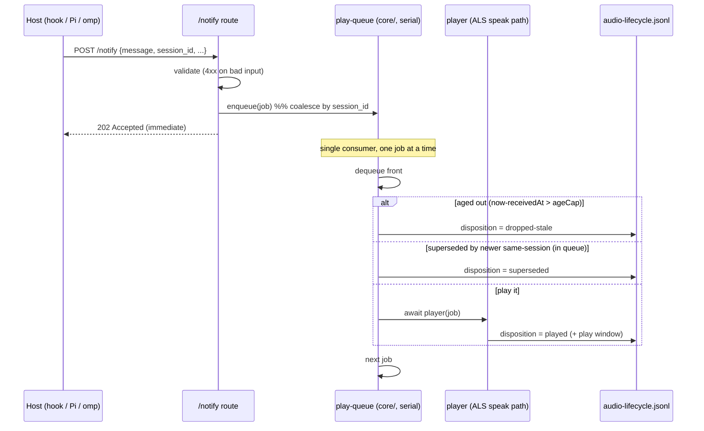

# Voice Playback Serialization - Plan

> **Product Contract preservation:** Product Contract (R1–R7, success criteria, scope,
> constraints) unchanged from the `ce-brainstorm` requirements. This plan adds the Planning
> Contract (KTDs, Implementation Units, Verification, Definition of Done) below.

## Goal Capsule

- **Objective:** Stop voice notifications from playing over each other. One voice at a time,
  globally — a new turn never talks over an in-progress one — while staying responsive (callers
  ack immediately, don't block on playback).
- **Product authority:** Ed.
- **Open blockers:** None. Thresholds (age cap, depth cap) are tunable knobs, not blockers.

## Context

Phase 2 of the voice work (`docs/plans/2026-07-09-001-fix-voice-drop-observability-plan.md`,
Phase 1 merged #89/#90). Phase 1's audio-lifecycle log confirmed the defect: the daemon
(`core/server.ts`) has no playback serialization, so concurrent `/notify`s each spawn their own
`afplay` and play simultaneously (measured ~8 s overlap; Ed: *"talking over each other"*). Not
single-clip truncation (R4 proved clips play to completion). This plan resolves the concurrency
behavior.

---

## Product Contract

### R1 — Global serial playback
One voice at a time across **all** sessions and hosts (Claude Code hooks, Pi, omp, mute script).
A new line never starts while another plays. Global, not per-session (per-session leaves the
cross-session overlap that is the whole problem).

### R2 — Ack on receipt, play async (`202`)
`/notify` returns as soon as the request is validated + accepted; synth+playback run async from
the queue. Callers stop blocking (greeting hook ~6.8 s → ~ms; Stop hook ~9–12 s → ~ms). Ships
*with* the queue — bare fire-and-forget without a queue would worsen overlap.

### R3 — Queue, don't interrupt
A line arriving during playback is queued; the current line always finishes. No barge-in, no
priority lanes in v1.

### R4 — Newest-per-session coalescing
Queued lines coalesce by `session_id`: a session's newer line replaces its older *queued* line.
Coalescing never touches the currently-playing line. Lines with no `session_id` don't coalesce
but still serialize + age-cap.

### R5 — Age cap on stale lines
A queued line that has waited too long (age from receipt) is dropped rather than played late.
Threshold is a tunable knob.

### R6 — Respects mute; can't deadlock
Mute still suppresses (unchanged). A stuck playback can't stall the queue: each play stays
bounded by the existing `afplay` process timeout, and the queue advances on that bound.

### R7 — Verifiable via disposition logging
The Phase 1 audio-lifecycle record gains a `disposition` — `played` / `dropped-stale` /
`superseded`. Success is observable: two overlapping requests record **non-intersecting**
`play_started_at` / `play_ended_at` windows; drops show a reason.

### Success criteria
- A rapid burst from multiple concurrent agents is heard one at a time, in full — no overlap
  (verified: no intersecting play windows in the lifecycle log).
- Callers return in ms (`202`), not after playback.
- Under many chatty agents, you hear each one's *latest* line, bounded.
- `bun test` + smoke + Pi build pass; mute still suppresses.

### Scope boundaries
**In:** daemon-side global serial queue + coalescing + age cap; `202`-on-receipt; disposition
logging. **Out (v1):** priority/barge-in lanes; per-host/per-session policies; cross-machine
coordination; changing *which* turns speak or *what* text (the untouched selection path).

### Constraints (AGENTS.md)
- `core/` host-neutral — the queue is generic playback ordering, no host-specific logic.
- **`/notify` contract change** (200-after-play → 202-on-receipt) carries an explicit
  compatibility note: stays 2xx (`response.ok` true); current callers only log the status, so
  none break; semantics shift "delivered" → "accepted," and true playback outcome now lives in
  the audio-lifecycle log.

### Accepted tradeoff
Under fast sequential turns from a *single* agent, intermediate lines may be skipped
(coalesced/aged) — the deliberate flip side of R4/R5; that agent's text is on screen.

---

## Key Technical Decisions

- **KTD1 — In-process, in-memory serial queue.** The daemon is one long-lived Bun process, so a
  plain in-memory FIFO + a single async consumer loop suffices — no broker, no persistence.
- **KTD2 — Generic queue, injected player.** The queue holds *opaque jobs* and is handed an
  async "play one job" function. Keeps `core/` host-neutral **and** unit-testable without
  `afplay` (fake player). Mirrors the modular `core/circuit-breaker.ts` / `core/mute.ts` style.
- **KTD3 — Coalesce only affects queued jobs, never in-flight.** Satisfies R3 (no interruption)
  and R4 (newest-per-session) together: the playing job was already dequeued, so it can't be
  superseded.
- **KTD4 — Reuse the existing ALS speak path as the player.** Move the `audioCapture.run` +
  `speakWithFallback` + resolution/lifecycle writes out of the `/notify` handler into the
  consumer. Minimal new playback code; mute, resolution-log, and lifecycle behavior unchanged.
- **KTD5 — Disposition extends the existing lifecycle schema.** One row per job with a
  `disposition` field (default `played`, back-compatible). Dropped/superseded rows carry the
  reason and no playback metrics. Correlated with the played rows, DRY.
- **KTD6 — `202` stays 2xx.** `response.ok` remains true, so callers treating 2xx as success are
  unaffected; the contract note is documented per the AGENTS.md invariant.
- **KTD7 — Age cap checked at dequeue** (from `receivedAt`), not enqueue — a job that waited too
  long behind a long play is dropped rather than played stale.

## High-Level Technical Design

*The consumer awaits each `player(job)` — nothing plays concurrently. Coalescing/age checks act
on queued jobs only; the in-flight job always finishes (R3).*

---

## Implementation Units

### U1. Serial play-queue module (`core/play-queue.ts`)

- **Goal:** In-process serial queue — enqueue, coalesce by `session_id`, drop stale at dequeue,
  single-consumer drain that plays one job at a time via an injected async player. Host-neutral,
  decoupled from TTS.
- **Requirements:** R1, R3, R4, R5, R6.
- **Dependencies:** none.
- **Files:** `core/play-queue.ts` (new), `tests/core/play-queue.test.ts` (new).
- **Approach:** FIFO of jobs `{ id, sessionId, receivedAt, payload }`. `enqueue`: if a *queued*
  job shares `sessionId`, replace it and emit `superseded` for the old; else append (optional
  `maxDepth` → drop oldest, belt-and-suspenders). A single async consumer: dequeue front → if
  `now - receivedAt > ageCapMs` emit `dropped-stale` (skip) → else `await player(payload)`
  (serial). The consumer catches player errors and advances; idles on an awaited signal when
  empty (no busy-spin). Disposition outcomes surface via a callback so the caller logs them.
  Thresholds come from `core/env.ts` `parseBoundedInt` (`ECHO_*`), injectable for tests.
- **Execution note:** Test-first — pure queue semantics against a **fake player** (records
  concurrency + call order); no `afplay`.
- **Patterns to follow:** `core/circuit-breaker.ts`, `core/mute.ts` (host-neutral module shape);
  `core/env.ts` `parseBoundedInt`.
- **Test scenarios:**
  - Covers R1. Two jobs enqueued → fake player invoked one at a time; max observed concurrency = 0.
  - FIFO order across distinct sessions.
  - Covers R4. Same-session job replaces the queued one → old emits `superseded`; only newest plays.
  - Covers R5. Job older than `ageCap` at dequeue → `dropped-stale`, player not called.
  - Covers R3. A new same-session job while one plays does **not** stop the in-flight; supersedes
    only the queued entry.
  - Covers R6. A rejecting player → consumer catches, advances to next (no stall); a slow player
    is bounded by the player itself, not the queue.
  - Empty queue → consumer awaits without spinning.
- **Verification:** `bun test tests/core/play-queue.test.ts` green; fake player proves zero
  concurrent plays and correct coalesce/drop dispositions.

### U2. Wire the queue into `/notify` + `202`

- **Goal:** `/notify` validates + enqueues + returns `202`; the daemon's ALS speak path becomes
  the queue's injected player.
- **Requirements:** R1, R2.
- **Dependencies:** U1.
- **Files:** `core/server.ts`, `tests/core/notify-queue.test.ts` (new).
- **Approach:** Instantiate one queue at daemon boot; `player` = the current `sendNotification`
  speak body (`audioCapture.run` → `speakWithFallback` → resolution + lifecycle writes). `/notify`
  route: validate as today, build `job { sessionId, receivedAt: now, payload }`, `enqueue`,
  return `202 { status: "accepted", request_id }`. Validation errors still return 4xx **before**
  enqueue. Mute semantics unchanged (handled inside the player path).
- **Execution note:** Failing test first — "`/notify` returns 202 and the job plays via the
  consumer." Keep the response 2xx.
- **Patterns to follow:** existing `/notify` route + `sendNotification` (`core/server.ts`); the
  Phase 1 `audioCapture` ALS wrapper.
- **Test scenarios:**
  - Covers R2. `/notify` returns `202` immediately (round-trip < 100 ms with a stub player).
  - The enqueued job plays via the consumer; a lifecycle row is written with `disposition: played`.
  - Covers R1. Two concurrent `/notify` → serialized (verified via the injected player / queue).
  - Invalid message still returns 4xx before enqueue (no job created).
  - Muted `/notify` → player path suppresses as today (no regression).
- **Verification:** `bun test` green; `202` measured; a real `/notify` still speaks via the
  consumer (smoke).

### U3. Disposition in the audio-lifecycle log

- **Goal:** Extend `AudioLifecycleEvent` with `disposition`; queue callbacks write
  `dropped-stale` / `superseded` rows; the player writes `played` rows.
- **Requirements:** R7.
- **Dependencies:** U1, U2.
- **Files:** `core/audio-log.ts`, `core/server.ts` (wire callbacks), extend
  `tests/core/audio-lifecycle-log.test.ts`.
- **Approach:** Add `disposition: 'played' | 'dropped-stale' | 'superseded'` (default `played` so
  existing rows/readers are unaffected). Queue disposition callbacks write a minimal row
  (`disposition`, `session_id`, `request_id`, `message_chars`, reason; no play metrics). Played
  rows keep the Phase 1 metrics.
- **Execution note:** Extend the existing U1(Phase 1) test file; keep back-compat.
- **Patterns to follow:** `core/audio-log.ts` `writeAudioLifecycleEvent` + its test.
- **Test scenarios:**
  - Covers R7. `played` row carries `disposition: played` + play window (existing behavior).
  - `dropped-stale` row on age-cap: disposition set, `play_time_ms` null.
  - `superseded` row on coalesce: disposition set, `play_time_ms` null.
  - Back-compat: an event without `disposition` still parses (defaulted).
- **Verification:** `bun test tests/core/audio-lifecycle-log.test.ts` green.

### U4. Env knobs + docs (age cap, depth cap, `202` compat)

- **Goal:** Expose the tunable thresholds and document the behavior + the `/notify` contract
  change.
- **Requirements:** R5, R2, R1.
- **Dependencies:** U1, U2.
- **Files:** `core/play-queue.ts` (read env via `core/env.ts`), `docs/configuration.md`,
  `docs/http-api.md`.
- **Approach:** `ECHO_PLAY_QUEUE_AGE_CAP_MS` (sensible default, floor small) and optional
  `ECHO_PLAY_QUEUE_MAX_DEPTH` (generous default), via `parseBoundedInt`. Document both in
  `docs/configuration.md`; document the `202`-on-receipt semantics + compatibility note in
  `docs/http-api.md`.
- **Patterns to follow:** the `ECHO_* ?? default` env convention in `core/`; the existing
  `docs/http-api.md` / `docs/configuration.md` structure.
- **Test scenarios:**
  - Env parse bounds: NaN/negative/zero → default; floor respected (mirror `core/env.ts` tests).
  - Test expectation for the docs edits: none — documentation only; verified by the compat note
    being present in `docs/http-api.md`.
- **Verification:** `bun test` env bounds green; docs updated and internally consistent.

### U5. Overlap acceptance test (the R7 headline)

- **Goal:** Prove the feature end-to-end: overlapping `/notify`s record non-intersecting play
  windows; a burst is heard one-at-a-time.
- **Requirements:** R7, R1.
- **Dependencies:** U1, U2, U3, U4.
- **Files:** `tests/core/playback-overlap.test.ts` (new, daemon integration).
- **Approach:** Fire two (then N) `/notify`s concurrently against an ephemeral-port daemon with a
  deterministic injected player (fixed "play duration", no real `afplay`), and assert the
  lifecycle rows' `play_started_at` / `play_ended_at` windows do **not** intersect. This is the
  acceptance test for the whole feature.
- **Execution note:** Must **fail** against pre-serialization behavior (overlap) and pass after —
  the red→green anchor for the plan. Use the injected player for determinism; keep real-audio
  coverage in the smoke script.
- **Patterns to follow:** `tests/core/audio-lifecycle-server.test.ts` (PORT=0, spawn-stub,
  no `server.stop()` in `afterAll` — AGENTS.md #47).
- **Test scenarios:**
  - Covers R1/R7. Two concurrent `/notify` (distinct sessions) → both `played`, non-intersecting
    windows.
  - Two concurrent same-session → one `superseded`, the survivor plays alone.
  - Burst of N distinct sessions → all serialized, order preserved, no intersecting windows.
- **Verification:** green; non-intersecting windows in the recorded rows.

---

## Verification Contract

- **Gate 1:** `bun test` green — queue unit (U1), notify/202 (U2), lifecycle disposition (U3),
  env bounds (U4), overlap acceptance (U5).
- **Gate 2 (headline):** U5 overlap test green — non-intersecting play windows on concurrent
  `/notify`; `202` round-trip < 100 ms.
- **Gate 3:** mute still suppresses; validation still returns 4xx before enqueue.
- **Ship gate (AGENTS.md):** `bun test` + `PORT=8889 tests/smoke-core.sh` + the Pi
  `bun build` before any PR; restart after `core/server.ts` edits
  (`launchctl kickstart -k "gui/$UID/com.echo"`).

## Risks & Mitigations

- **Consumer loop dies on a player throw** → wrap each play in try/catch; always advance (U1 test).
- **Busy-spin when idle** → consumer awaits a wake signal on empty queue, not a poll loop.
- **`/notify` contract change** → 2xx preserved; callers only log status; documented (KTD6/U4).
- **Non-deterministic overlap test** → injected player with a fixed delay, not real `afplay` (U5).
- **AGENTS.md invariants** → queue is host-neutral (no host imports); no `server.stop()` in
  `afterAll`; `ECHO_*` env; lifecycle log stays under `~/.agents/Echo/`.

## Definition of Done

- Global serial queue merged: concurrent `/notify`s never overlap (U5 green, non-intersecting
  windows); each active session's latest line heard, bounded; current line never interrupted.
- `/notify` returns `202` on receipt (measured); callers unblocked; contract note documented.
- Disposition (`played` / `dropped-stale` / `superseded`) in the lifecycle log.
- Mute unchanged; `bun test` + smoke + Pi build pass.
- Cross-links the `202` Outstanding Question in the Phase 1 plan (both point here).

## Open Questions (execution-time)

- Default values for `ECHO_PLAY_QUEUE_AGE_CAP_MS` / `ECHO_PLAY_QUEUE_MAX_DEPTH` — pick during U4
  from real cadence; not blocking.
- Whether the injected-player seam also simplifies a future test-only playback stub elsewhere —
  note if it emerges; don't build speculatively.

## Sources & Research

- Origin requirements (this file's Product Contract; `product_contract_source: ce-brainstorm`).
- Phase 1 plan: `docs/plans/2026-07-09-001-fix-voice-drop-observability-plan.md` (overlap
  confirmation, `202` prototype results, R7).
- Code grounding: `core/server.ts` (`/notify` route, `sendNotification`, `playAudio` + inline
  edgetts playback, `speakWithFallback`, `audioCapture` ALS, `AUDIO_PROCESS_TIMEOUT_MS`);
  `core/audio-log.ts` (Phase 1); `core/circuit-breaker.ts` / `core/mute.ts` (module shape);
  `tests/core/audio-lifecycle-server.test.ts` (integration harness).
- Invariants: AGENTS.md (`core/` host-neutral, no `server.stop()` in `afterAll`, `ECHO_*` env,
  user-owned paths).
