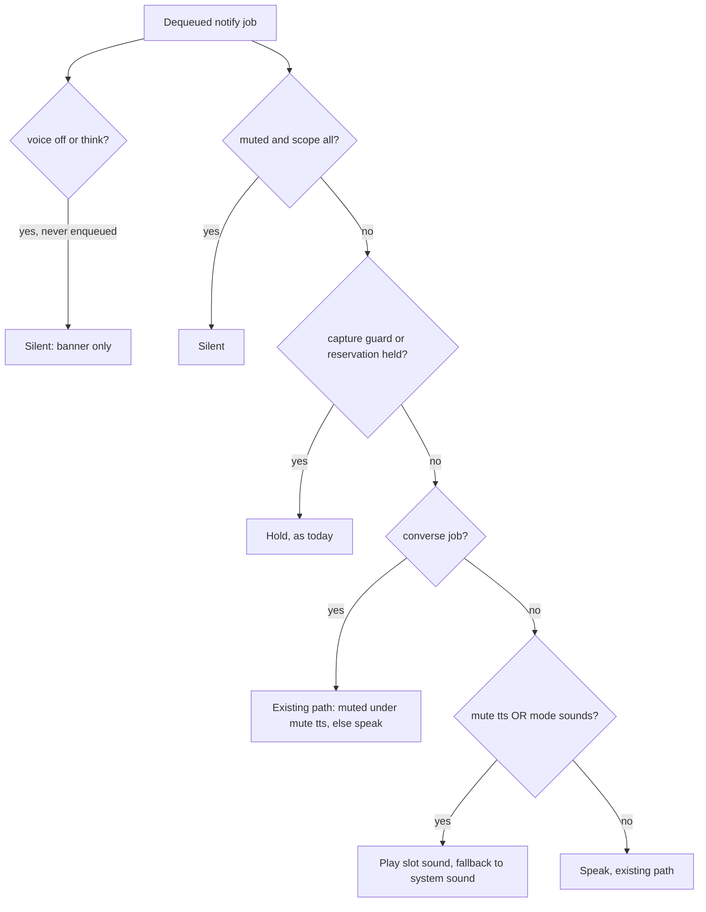

# Notification Sounds and Sounds-Only Mode - Plan

## Goal Capsule

- **Objective:** The operator can tell from a short sound alone whether an agent needs them, has finished, or is just reporting, and can run Echo with no speech at all without losing those signals.
- **Means:** an optional `slot` tag on `/notify`, a sound-or-speech decision inside the play-queue player, and a mute-style mode state file switched by `/echo-mode` (KTD1-KTD4).
- **Product authority:** Ed. This plan covers only the sound set and the output mode. Auto-quiet during desktop voice conversations is a separate plan (see How This Work Fits Together). Product Contract wins on behavior; KTDs win on mechanism.
- **Stop conditions:** stop and ask if delivering a requirement would change the `/notify` response contract, make a notification sent as silent (`voice_enabled: false` or `speak_mode: think`) audible, or require the daemon to open the microphone.
- **Open blockers:** None.
- **Product Contract preservation:** changed: R10, mode persisted in its own state file instead of config.json (user-directed during planning, because config.json is read once at daemon start). Added: R13, replay speaks in sounds-only mode (user-directed during review). R1, R6, R9 clarified with no scope change: silent requests stay silent, and `echo_ask` mute behavior is unchanged.

---

## Product Contract

### Summary

Echo gets its own three-slot sound set (request, done, generic notification), modeled on Herdr's `[ui.sound]` slots but independent of Herdr. A global output mode switches between speech (today's behavior) and sounds-only. Muting TTS plays the sounds in place of speech, and `mute all` stays fully silent.

### Problem Frame

Echo speaks every notification. When the operator is already talking with an agent, spoken notifications collide with that conversation and Echo talks over things it should not. Muting TTS today gives total silence, so the operator loses the one signal they still want: that an agent is blocked on them or has finished. Herdr already gives this with three sound files, but only inside Herdr.

<!-- ce-section: work-relationships -->
### How This Work Fits Together

This plan covers the sound set and the speech or sounds-only mode. The breakdown below is the current understanding, not a committed roadmap.

- Auto-quiet during desktop voice conversations ([plan](2026-10-07-1549-feat-auto-quiet-voice-conversation-plan.md)): while ChatGPT or Claude desktop is in voice mode, Echo switches to sounds-only automatically.
  - Depends on this plan's sounds-only behavior (R6) and mute rules (R7, R8).
  - Narrows R9: during such a conversation, `echo_ask` fails fast instead of speaking.
- Desktop-app notification sounds: dropped. Those apps play their own notification sounds.

### Key Decisions

- **One global mode, not per-event configuration.** Simpler to reason about; per-event tuning was rejected. Governs R5, R6, R10. (session-settled: user-directed - chosen over per-event sound/speech settings: avoids configuration sprawl.)
- **Speech mode does not play cues.** Speech mode stays exactly as it is today. Governs R5. (session-settled: user-directed - chosen over sound-then-speech: no added noise or latency on every line.)
- **Three slots, including a generic notification sound.** Mirrors Herdr's request/done/notification set. Governs R1. (session-settled: user-directed - chosen over two slots with silent updates.)
- **Bundle Echo sounds, fall back to macOS system sounds.** Echo has its own sound identity and still plays something if a bundled file is missing. Governs R3, R4. (session-settled: user-directed - chosen over system sounds only, or no defaults.)
- **`mute all` stays total silence; `mute tts` swaps speech for sounds.** Keeps a reliable full-silence switch for meetings and recordings. Governs R7, R8. (session-settled: user-approved - chosen over sounds on every mute or a new sounds mute scope.)
- **`echo_ask` questions are always spoken.** The operator asked to talk, so sounds-only does not apply. Governs R9. (session-settled: user-directed - chosen over request-sound plus on-screen text.)
- **Mode is global across every Echo session.** Matches `/echo-mute`. Governs R10. (session-settled: user-approved - chosen over per-project or global-plus-override.)
- **Replay speaks in sounds-only mode, unless muted.** The operator asked to re-hear the words. Governs R13. (session-settled: user-directed - chosen over replay following the mode: a replayed ding cannot say what it meant.)

### Requirements

**Sound set**

- R1. Echo classifies each notification it would speak into exactly one of three slots: request (an agent needs a response, approval, or attention), done (an agent finished its turn), or generic notification (everything else, including greetings and progress updates). Notifications sent as silent (`voice_enabled: false` or `speak_mode: think`) stay silent in every mode.
- R2. Each slot plays one configurable audio file, and the operator can override any slot by path.
- R3. Echo ships its own default sound for each slot, so no setup is needed and Herdr is not required.
- R4. When a slot's configured or bundled file is missing or unplayable, Echo plays a macOS system sound for that slot instead of staying silent.

**Output mode**

- R5. In speech mode (the default), Echo behaves exactly as it does today, with no sound cues.
- R6. In sounds-only mode, Echo plays the slot's sound for each notification and speaks nothing, except as R9 and R13 allow.
- R7. When TTS is muted, Echo plays the slot's sound in place of the spoken line, in either mode.
- R8. When `mute all` is active, Echo plays neither speech nor sounds.
- R9. `echo_ask` questions are spoken in every mode, and how `echo_ask` behaves under mute is unchanged.
- R13. `cli/echo replay` speaks the replayed lines in every mode; `mute tts` and `mute all` still silence it, as today.

**Switching**

- R10. The mode is one global setting, persisted across daemon restarts like mute state, and applied to every Echo session.
- R11. The operator can switch the mode at runtime from an in-session slash command in each harness that already ships `/echo-mute`, and from a `cli/echo` subcommand, without editing files or reloading.
- R12. The current mode is visible wherever Echo reports mute state today (`cli/echo status` and the slash command's status output).

### Acceptance Examples

- AE1. **Covers R5.** **Given** speech mode and nothing muted, **when** an agent requests approval, **then** Echo speaks its existing approval line and plays no sound.
- AE2. **Covers R1, R6.** **Given** sounds-only mode, **when** an agent finishes its turn, **then** the done sound plays and nothing is spoken.
- AE3. **Covers R1, R6.** **Given** sounds-only mode, **when** a session starts and Echo would greet, **then** the generic notification sound plays.
- AE4. **Covers R7.** **Given** speech mode with TTS muted, **when** an agent asks a question, **then** the request sound plays and nothing is spoken.
- AE5. **Covers R8.** **Given** `mute all` is active in either mode, **when** any notification arrives, **then** nothing is audible.
- AE6. **Covers R9.** **Given** sounds-only mode, **when** an agent calls `echo_ask`, **then** the question is spoken and the reply is captured as usual.
- AE7. **Covers R4.** **Given** the done slot points at a file that no longer exists, **when** an agent finishes, **then** the done slot's macOS system sound plays.
- AE8. **Covers R10, R11.** **Given** two agent sessions in different harnesses, **when** the operator switches to sounds-only from one of them, **then** the next notification from the other session is a sound, not speech.

### Scope Boundaries

- Per-event choice of sound, speech, or both is out of scope (Key Decisions).
- Per-project modes are out of scope; the mode is global only.
- A mute scope that silences only the sounds is out of scope; `mute all` covers silence.
- Auto-quiet during desktop voice conversations is a separate plan.
- Visual banners are unchanged by this work.
- A line that played as a sound instead of speech is not added to the replay buffer, the same as a muted line today.

### Dependencies / Assumptions

- Hosts already report request and done events: the request lines in `shared/hil.ts` (question, approval, attention) and each adapter's completion path, such as `adapters/claudecode/hooks/VoiceCompletion.hook.ts`. The assumption is that the slot can be derived from those existing events.
- Any change that tells the daemon which slot a notification belongs to touches `/notify`. The root `AGENTS.md` requires that change to be additive, with a compatibility plan, so existing callers keep working.

### Sources / Research

- Herdr's sound slots: `[ui.sound]` in the operator's Herdr config, with `path` (notification), `request_path`, and `done_path`.
- Existing mute scopes and semantics: [docs/what-echo-does.md](../what-echo-does.md), `core/mute.ts`.
- Request-event wording and kinds: `shared/hil.ts`.
- Voice-ask behavior that R9 preserves: [docs/converse.md](../converse.md).
- Notify pipeline seams: `core/server.ts` (`speakWithFallback` mute and capture gates, play-queue player, `/notify` parse, `/mute`, `/health`), `core/play-queue.ts`, `core/mute.ts`, `core/env.ts` (config cached once per process).
- Additive `/notify` enum precedent: `shared/speak-mode.ts`.

---

## Planning Contract

### Key Technical Decisions

- KTD1. **Slot is an optional `/notify` field set by adapters; omitted means `generic`.** The daemon cannot infer the event kind from text, and an omitted field keeps every existing caller working. Shared names and a parser live in `shared/` beside `speak_mode`; an unknown value is a 400, like `speak_mode`. Implements R1.
- KTD2. **Sound-or-speech is decided in the play-queue player at dequeue, in `speakWithFallback`.** Sounds then inherit no-overlap, coalescing, age-out, and the capture guard, and mute and mode are read at the same moment as today's lazy mute read. Never at accept and never in adapters. Implements R5-R8.
- KTD3. **Mode lives in its own state file beside `mute.json`, read on every dequeue.** (session-settled: user-directed - chosen over a config.json default with a state-file override, and over config.json with a reload: one live source, no reload.) Not inside `mute.json`, because `setMuteState` rewrites that whole file. A missing or malformed file reads as speech. Implements R10.
- KTD4. **New `/echo-mode speech|sounds|status` command in every harness that ships `/echo-mute`, backed by `cli/echo mode`, `scripts/mode.sh`, and a `POST /mode` endpoint.** (session-settled: user-directed - chosen over extending `/echo-mute`: `mute sounds` reads as the opposite of what it does.) Registered through `shared/extension.ts` like mute, so the lockstep test covers it. Implements R11, R12.
- KTD5. **Converse and replay jobs skip only the mode.** A job whose `/notify` request carried `capture_reservation` (the converse flag U1 adds to the queued job), and a job enqueued by `/replay`, take today's unchanged `speakWithFallback` path, including its speaker-mute gate: `mute tts` or `mute all` still returns muted, and only `mode: sounds` is ignored. Implements R9, R13.
- KTD6. **Slot files are config.json keys; bundled files live under `core/sounds/`.** `stage_payload` already copies `core/`, so the staged daemon finds them relative to its own module. Playback uses `afplay -v` like `playAudio`. On a missing or failing file, play the slot's system sound from `/System/Library/Sounds`: request `Glass`, done `Hero`, generic `Pop`. Implements R2-R4.

### High-Level Technical Design

`mute all` is `muted && scope === "all"` and `mute tts` is `muted && scope === "tts"`, read from one `readMuteState()` call. The scope alone is not enough, because an unmuted read normalizes to `{muted: false, scope: "all"}`.

### Assumptions

- Bundled sounds are CC0 or made for Echo, under one second, in a format `afplay` plays. The system-sound fallback means a late asset never blocks shipping.

---

## Implementation Units

### U1. Slot field on the `/notify` contract

- **Goal:** Carry `request` / `done` / `generic` from callers to the queued job.
- **Requirements:** R1; KTD1.
- **Dependencies:** none.
- **Files:** `shared/notify-slot.ts` (new), `shared/notify-client.ts`, `core/types.ts`, `core/notify-client.ts`, `core/server.ts` (`/notify` parse, `NotifyJobPayload` gains slot and a converse flag), `docs/http-api.md`, `tests/shared/notify-client.test.ts`, `tests/core/notify-client.test.ts`, `tests/core/server-contract-source.test.ts`.
- **Approach:** Mirror `shared/speak-mode.ts` for names and parsing. Add the field to `core/notify-client.ts`'s whitelist so it is not dropped. `sendNotification` / `buildNotifyPayload` take the slot as an optional argument, so existing positional callers compile unchanged.
- **Patterns to follow:** `speak_mode` end to end.
- **Test scenarios:**
  - Payload with `slot: "done"` reaches the queued job as `done`.
  - Payload without `slot` reaches the job as `generic`.
  - `slot: "loud"` returns 400 and enqueues nothing.
  - `buildNotifyPayload` without a slot emits no `slot` key.
- **Verification:** Old payloads behave byte-for-byte as before; the new field round-trips.

### U2. Mode state file and `/mode` endpoint

- **Goal:** One persisted, global, live mode.
- **Requirements:** R10, R12; KTD3.
- **Dependencies:** none.
- **Files:** `core/output-mode.ts` (new), `core/server.ts` (`POST /mode`, `/health` `mode` field), `tests/core/output-mode.test.ts` (new), `tests/core/mute-endpoint.test.ts` pattern for a new `tests/core/mode-endpoint.test.ts`, `tests/e2e-adapters.sh`, `tests/e2e-converse.sh`, `docs/http-api.md`.
- **Approach:** Copy `core/mute.ts`: tolerant read, atomic write, path in the same user-owned directory, overridable by an env path for isolation. Give `/mode` its own rate-limit bucket in the shared `rateKey` expression beside `/mute`, so a notify burst cannot starve a mode switch. Add the redirect to both e2e scripts so tests never touch the operator's file.
- **Patterns to follow:** `core/mute.ts`, `/mute` handler, `/health` mute block.
- **Test scenarios:**
  - No file reads as `speech`.
  - Malformed JSON reads as `speech` and does not throw.
  - `POST /mode {"mode":"sounds"}` persists and `/health` reports `sounds`.
  - Invalid mode value returns 400 and leaves the file unchanged.
  - Toggling mute does not change the mode file.
  - A `/mode` POST succeeds after the notify rate-limit bucket is exhausted.
- **Verification:** Mode survives a daemon restart in an isolated instance.

### U3. Slot sound playback and the dequeue gate

- **Goal:** Play the right sound or speak, per the gate in the design.
- **Requirements:** R2-R9, R13; KTD2, KTD5, KTD6; AE1-AE7.
- **Dependencies:** U1, U2.
- **Files:** `core/slot-sound.ts` (new), `core/sounds/request.*`, `core/sounds/done.*`, `core/sounds/generic.*` (new assets), `core/server.ts` (`speakWithFallback`), `shared/echo-env.ts` and `shared/config-schema.json` (three slot-path keys), `core/audio-log.ts` (additive disposition for sound plays), `tests/core/slot-sound.test.ts` (new), `tests/core/mute.test.ts`, `tests/shared/config-schema-lockstep.test.ts`, `tests/scripts/install-payload.test.ts`, `tests/core/no-host-strings.test.ts` and `tests/core/architecture-invariants.test.ts` (skip `core/sounds/` binaries in their text scans).
- **Approach:**
  1. Pick the configured path if set, otherwise the bundled file. If that file is missing or `afplay` exits non-zero, play the slot's system sound. Never fall back from a configured path to the bundled file.
  2. In `speakWithFallback`, apply the gate order from the design before the provider loop.
  3. A sound-substituted line is not recorded in the replay ring (Scope Boundaries).
  4. Log sound plays to the audio lifecycle log with the new disposition.
- **Execution note:** Implement the gate test-first with the spawn stub from `tests/core/mute.test.ts`; it asserts on `afplay` argv without playing audio.
- **Patterns to follow:** `playAudio` (`afplay -v`, `waitForProcess` timeout), mute gate and capture guard in `speakWithFallback`.
- **Test scenarios:**
  - Covers AE1. Speech mode, unmuted, `request` job: TTS path runs, no slot sound spawned.
  - Covers AE2. Sounds mode, `done` job: `afplay` spawned with the done file, no TTS provider called.
  - Covers AE3. Sounds mode, job without slot: generic file plays.
  - Covers AE4. Speech mode, `mute tts`, `request` job: request sound plays.
  - Covers AE5. `mute all`, either mode: nothing spawned.
  - Covers AE6. Sounds mode, converse job: speech path runs.
  - `mute tts`, converse job: returns muted, with no speech and no sound.
  - Covers AE7. Done slot path missing: system `Hero` plays.
  - Configured file whose `afplay` exits non-zero: system sound plays.
  - Capture guard active, sounds mode: job is held, no sound spawned.
  - Sounds mode line is absent from the replay ring.
  - Sounds mode, `/replay` job: the line is spoken, no slot sound spawned.
  - `mute tts`, `/replay` job: returns muted, with no speech and no sound.
  - `voice_enabled: false` in sounds mode: no spawn at all.
  - Mode switched to sounds while a job is queued: that job plays a sound.
  - Staged payload contains `core/sounds/`.
- **Verification:** The gate matrix tests pass, and the isolated e2e audible run plays each sound.

### U4. Adapters tag request and done

- **Goal:** Each host sends the right slot.
- **Requirements:** R1; KTD1.
- **Dependencies:** U1.
- **Files:** `adapters/claudecode/hooks/handlers/VoiceHil.ts`, `adapters/claudecode/hooks/handlers/VoiceNotification.ts`, `adapters/pi/index.ts`, `adapters/omp/index.ts`, `adapters/codex/hook.ts`, `adapters/grok/hook.ts`, `adapters/jcode/hook.ts`, `shared/hil.ts` (speak callback receives the slot), tests under `tests/adapters/<host>/` and `tests/shared/hil.test.ts`.
- **Approach:** HIL announces send `request`, turn-completion sends `done`, greetings send nothing. `maybeSpeakHil` passes `request` to its speak callback so Pi and omp do not re-derive it. Converse sends nothing new (KTD5).
- **Test scenarios:**
  - Claude HIL payload carries `slot: "request"`.
  - Claude Stop payload carries `slot: "done"`.
  - Pi and omp HIL and completion calls carry `request` and `done`.
  - Codex, Grok, Jcode stop branches carry `done`; session-start greetings carry no slot.
- **Verification:** `bun test` plus each adapter build in the Verification Contract.

### U5. `/echo-mode` command in every harness

- **Goal:** Switch and inspect the mode from a session or a terminal.
- **Requirements:** R11, R12; KTD4; AE8.
- **Dependencies:** U2.
- **Files:** `scripts/mode.sh` (new), `cli/echo` (`mode` subcommand, usage), `shared/mute-command.ts` (runner takes the `cli/echo` subcommand; add `createEchoModeCommand`), `shared/extension.ts` (mode feature + `registerEchoMode`), `adapters/claudecode/commands/echo-mode.md`, `adapters/claudecode/plugin/skills/echo-mode/SKILL.md`, `adapters/codex/skills/echo-mode/SKILL.md`, `adapters/grok/skills/echo-mode/SKILL.md`, `adapters/opencode/commands/echo-mode.md`, `adapters/codex/reconcile.ts`, `adapters/grok/reconcile.ts`, `adapters/opencode/reconcile.ts` (each hardcodes its single `echo-mute` link today; `adapters/claudecode/reconcile-commands.ts` already picks up every `commands/*.md`), `adapters/pi/index.ts`, `adapters/omp/index.ts`, `scripts/mute.sh` (status prints the mode line), `tests/shared/extension.test.ts`, `tests/shared/mute-command.test.ts`, `tests/scripts/echo-cli.test.ts`, `tests/scripts/mode-script.test.ts` (new).
- **Approach:** Follow the mute command path end to end: harness command, then `cli/echo mode <arg>`, then `scripts/mode.sh`, then `POST /mode`. Generalize the existing mute runner rather than copying it. Each reconciler registers, prunes, and supports `--check`, per [docs/adapters.md](../adapters.md).
- **Patterns to follow:** `/echo-mute` in each harness, `registerEchoMute`, `scripts/mute.sh`.
- **Test scenarios:**
  - Covers AE8. `cli/echo mode sounds` against an isolated daemon, then `/health` reports `sounds`.
  - `cli/echo mode status` prints the current mode.
  - Unknown argument prints usage and exits non-zero without a POST.
  - Each harness manifest lists `/echo-mode` wherever it lists `/echo-mute`, and `install.sh --check` reports a missing registration as stale.
  - `/echo-mute status` output includes the mode line.
- **Verification:** `cli/echo install --check` is clean after install; the lockstep test passes.

### U6. Documentation

- **Goal:** Shipped docs describe the mode, the sounds, and the changed meaning of `mute tts`.
- **Requirements:** R1-R13.
- **Dependencies:** U1-U5.
- **Files:** `docs/what-echo-does.md`, `docs/http-api.md`, `docs/operations.md`, `docs/configuration.md`, `docs/adapters.md`, `AGENTS.md` (Quick commands gain `cli/echo mode` and `/echo-mode`).
- **Approach:** Document behavior, not history. `CHANGELOG.md` is generated at release; do not edit it.
- **Test expectation:** none -- documentation only.
- **Verification:** Changed relative links resolve and `git diff --check` is clean.

---

## Verification Contract

| Gate | Command | Proves |
|---|---|---|
| Unit and integration | `bun test` | Gate matrix, contract, mode state, adapters, lockstep |
| Core smoke | `PORT=8889 tests/smoke-core.sh` | Daemon still serves `/notify` |
| Adapter e2e | `tests/e2e-adapters.sh`, then `--audible` once by hand | Isolated daemon plays each slot sound; mode state redirected to scratch |
| Converse e2e | `tests/e2e-converse.sh` | `echo_ask` still speaks in sounds-only mode |
| Builds | the Pi, omp, MCP, Jcode, Grok, Codex, and OpenCode `bun build` lines in `AGENTS.md` | Adapters still bundle |
| Install check | `bash scripts/install.sh --check` in a scratch home | `/echo-mode` registration reconciles |

Never run any of these against the operator's running daemon on `:3246`.

## Definition of Done

- Every R1-R13 and AE1-AE8 is covered by a passing test or the audible e2e run.
- A payload with no `slot` behaves exactly as before.
- Every gate in the Verification Contract passes.
- Docs in U6 are updated, and `CHANGELOG.md` is untouched.
- No abandoned-attempt code, debug output, or stray assets remain in the diff.
